# 💡 콘서트 예약 서비스

## Description

1. **전체적인 흐름에 대해서 유효한 토큰임을 항상 검증해야 한다.**
2. **좌석의 상태는 예약 가능 , 임시 예약, 예약 확정 3가지를 유지한다.**
3. **사용자는 좌석을 선택하고 5분 이내에 결제를 완료해야 한다**
4. **한 사용자가 좌석을 예약 중이라면 해당 좌석은 다른 사용자들이 접근할 수 없어야 한다.**

## Requirements

- 아래 5가지 API 를 구현합니다.
    - 유저 토큰 발급 API
    - 예약 가능 날짜 / 좌석 API
    - 좌석 예약 요청 API
    - 잔액 충전 / 조회 API
    - 결제 API


- 각 기능 및 제약사항에 대해 단위 테스트를 반드시 하나 이상 작성하도록 합니다.
- 다수의 인스턴스로 어플리케이션이 동작하더라도 기능에 문제가 없도록 작성하도록 합니다.
- 동시성 이슈를 고려하여 구현합니다.
- 대기열 개념을 고려해 구현합니다.

## **폴링이란?**

💡
폴링(Polling)은 클라이언트가 서버에게 주기적으로 요청을 보내 상태 변화를 확인하는 방식입니다.

즉 지속적으로 api를 콜 하는 것


<br>

## 대기열 토큰 검증 시퀀스 다이어그램

<br>

- 서비스를 이용할 토큰을 발급받는 API를 작성합니다.
- 토큰은 유저의 UUID 와 해당 유저의 대기열을 관리할 수 있는 정보 ( 대기 순서 or 잔여 시간 등 ) 를 포함합니다.
- 이후 모든 API 는 위 토큰을 이용해 대기열 검증을 통과해야 이용 가능합니다.

> 기본적으로 폴링으로 본인의 대기열을 확인한다고 가정하며, 다른 방안 또한 고려해보고 구현해 볼 수 있습니다.

- 기능적 요구사항 - (대략적인 정리)
    - 토큰 제공자가 토큰을 생성합니다
    - 토큰 제공자가 생성한 토큰을 토큰 저장소에서 저장합니다
    - 토큰 저장소는 대기열에 토큰을 저장합니다
    - 토큰 제공자는 생성된 토큰을 반환합니다

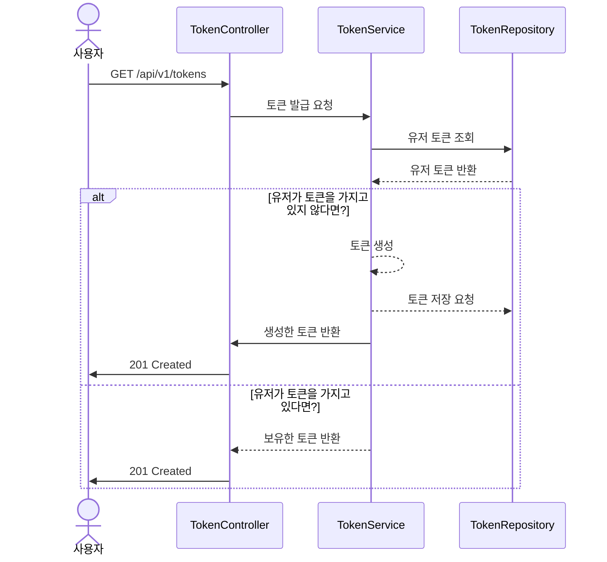

<br>

## 대기번호 조회 시퀀스 다이어그램

- 사용자는 자신의 대기번호를 조회 할 수 있다
- 자신의 차례가 되면 예약 페이지로 이동한다.
- 토큰의 상태를 변경시켜 준다

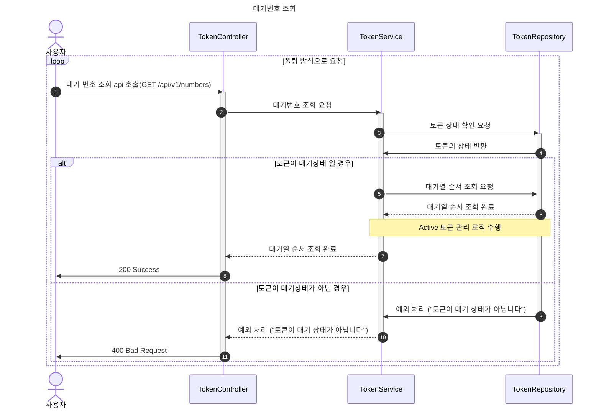

<br>

## 타임아웃 기능이 포함된 ACTIVE Token 관리 시퀀스 다이어그램

````mermaid
sequenceDiagram
    autonumber
    title 타임아웃 메커니즘이 포함된 대기열 1순위 토큰 처리 시퀀스 다이어그램
    participant TC as TokenController
    participant TS as TokenService
    participant TR as TokenRepository
    Note over TC, TR: 토큰이 대기열에서 1순위인 경우
    TS ->> TR: 현재 ACTIVE 토큰 수 조회
    TR -->> TS: ACTIVE 토큰 수 반환
    TS ->> TS: 최대 ACTIVE 토큰 수 설정 확인

    rect rgb(0, 0, 100, 0.1)
        Note over TS: [토큰 활성화 가능 여부 확인]
    end

    alt 현재 ACTIVE 토큰 수 < 최대 허용 수
        TS ->> TS: 현재 시간을 changeStatusTime 설정
        TS ->> TR: 토큰 상태 ACTIVATE 변경 및 changeStatusTime 업데이트
        TR -->> TS: 변경 결과 반환
        Note over TS, TR: 토큰에 10분 타임아웃 속성 부여됨
    else 현재 ACTIVE 토큰 수 >= 최대 허용 수
        TS ->> TS: 토큰 대기 상태 유지 (WAITING)
    end

    TS -->> TC: 대기열 처리 결과 반환
    Note over TS, TR: 별도 스케줄러가 주기적으로 ACTIVE 토큰 중<br/>10분 이상 활동이 없는 토큰을 만료 처리

````

<br>

## ACTIVE 토큰 관리 스케줄러 시퀀스 다이어그램

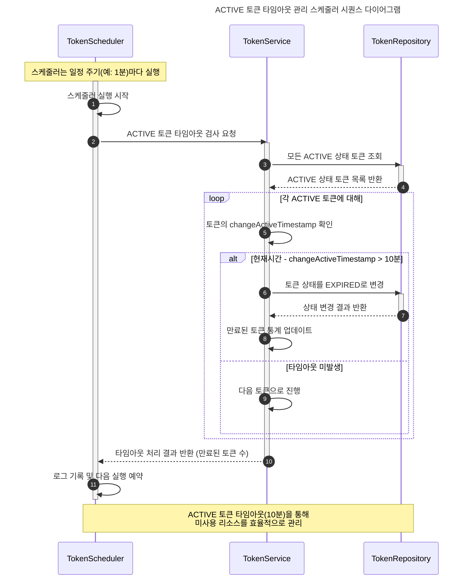

## 토큰 검증

- **예약가능 날짜/좌석 API, 좌석 예약 요청 API , 결제 API**  접근 전 해당 인터셉터를 통해 검증한한다

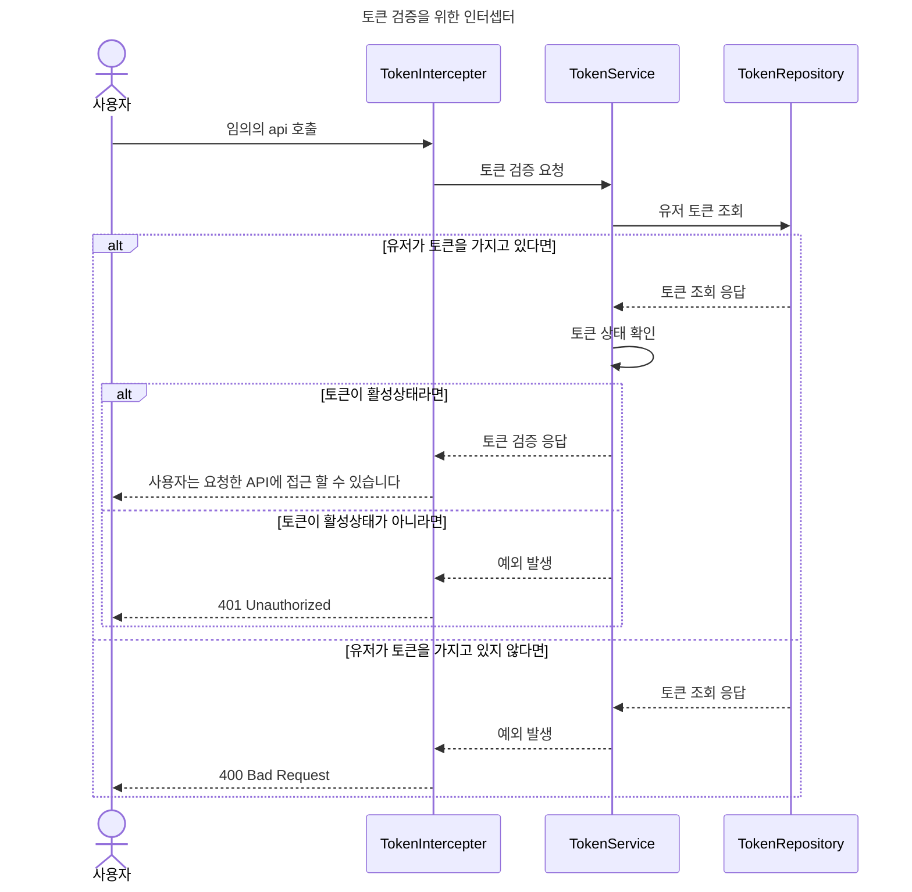

<br>

## 예약 가능한 날짜 조회

- 사용자가 api 를 호출한다
- api는 ReservationService를 호출한다.
- 해당 서비스는 예약 가능한 날짜 조회 메서드를 가지고 있다
- 해당 메서드를 통해서 콘서트 스케줄 레포지토리에 조회 요청을 한다.
- 레포지토리는 실제로 스케줄이 있는지 db에서 조회하고 응답한다.
- 서비스는 응답을 받고 API 로 전달한다
- 콘서트 스케줄은 예약가능한 날짜를 조회하고, 이를 반환한다

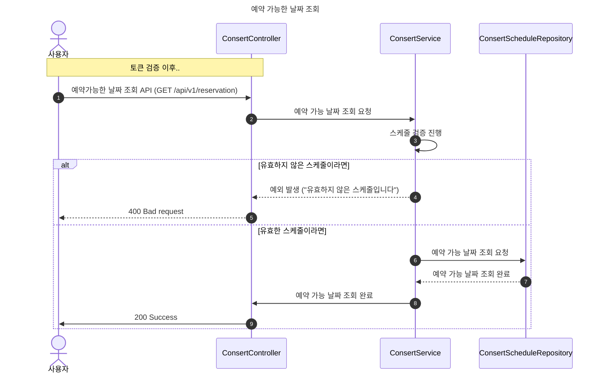

<br>

## 예약 가능한 좌석 조회 api

- 예약가능한 좌석의 숫자는 50개 입니다.
- 사용자는 예약가능한 날짜를 조회할 수 있어야 한다.
- 사용자는 예약가능한 좌석을 조회할 수 있어야 한다.
- 사용자는 예약가능한 날짜의 정보를 가지고 예약가능한 좌석을 조회 할 수 있어야 한다

<br>

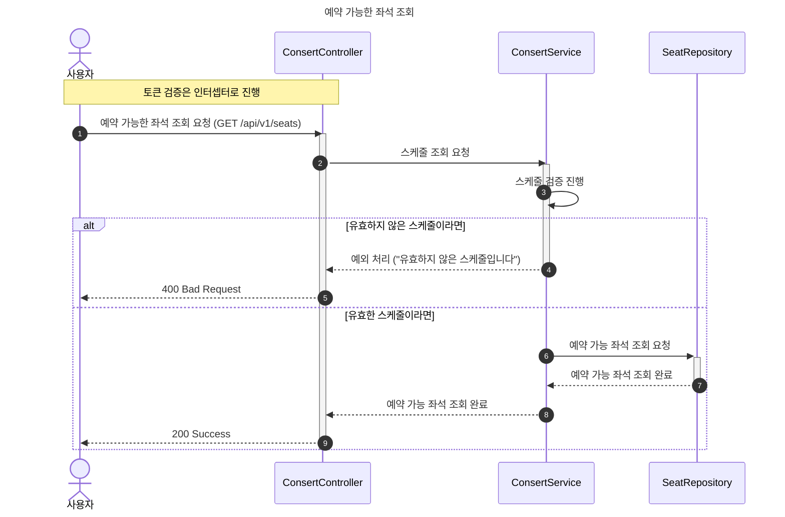

<br>

## 좌석 예약 요청 API

- 사용자가 api 호출한다
- 좌석 예약 요청 api의 전제 조건으로는 유효한 예약 날짜, 유효한 콘서트 스케줄, 예약가능한 좌석 이 3가지 조건이 충족해야 한다.
    - 왜? 좌석 예약 조회 api를 통해서 빈 좌석을 선택하였기 때문이다.
    - 대기열에서 자신의 차례가 되서 좌석 예매를 진행하는 것 이기 때문이다.

  → 동시성 이슈를 생각하면 충분히 발생할 수있는 부분

- 좌석 예약 api를 호출하는 순간 좌석은 해당 사용자에게 5분간 임시 배정된다
- 배정 시간내에 결제가 이루어지지 않는다면 좌석 임시 배정은 해제 된다.
- 예약에 성공하면 예약 성공 응답을 반환한다
- 예약에 실패하면 예약 실패 응답을 반환한다.

  기능적 요구사항
    - 예약가능한 날짜와 , 좌석 정보를 가지고 좌석예약을 진행합니다.
    - 유저가 해당 좌석에 접근하는 순간 좌석은 5분(혹은 별도로 지정한 시간동안) 임시배정됩니다.
    - 임시배정된 좌석에는 다른 유저들이 접근할 수가 없습니다

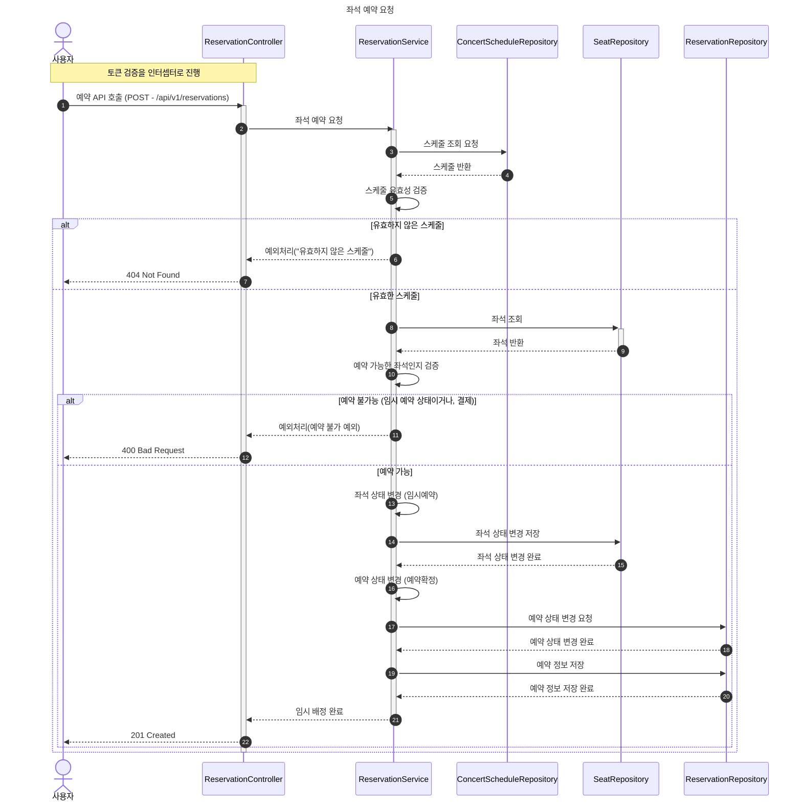

<br>

## 좌석 상태 확인 스케줄러

- 약 5분단위로 스케줄러를 실행하여 좌석 상태가 HELD인 것들을 Avaliable로 변경한다.
- 좌석의 상태는 HELD, AVALIABLE, BOOKED

<br>

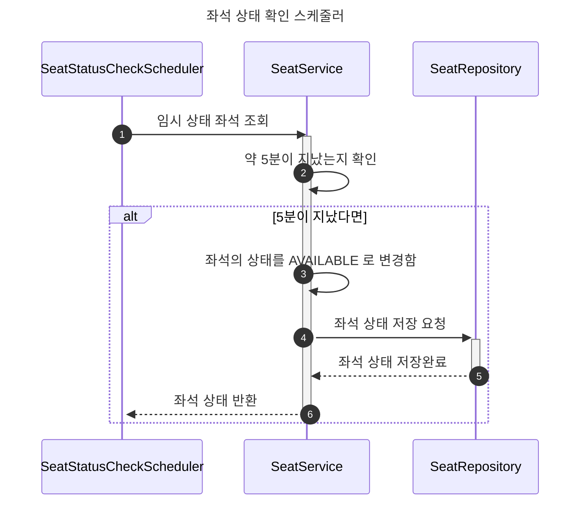

<br>

## 유저 포인트 충전 API

- 사용자는 금액을 충전할 수 있어야 한다.
- 유효한 사용자인지 확인해야한다.
    - 토큰을 사용해서 확인하면 좀 더 편하게 처리할 수 있지 않을까?
- 사용자는 자신의 금액을 조회 할 수 있어야 한다.
- 조회 후 결제에 사용될 금액이 부족한 경우 잔액을 충전하도록 강제한다.
- 조회 후 잔액이 충분한 경우 결제 단계로 넘어간다
- 금액을 충전할때 식별된 사용자만 충전할 수 있어야한다
- 본인 이외에는 충전을 할 수 없도록 해야한다.
- 충전 후 충전 기록을 남겨야 한다.

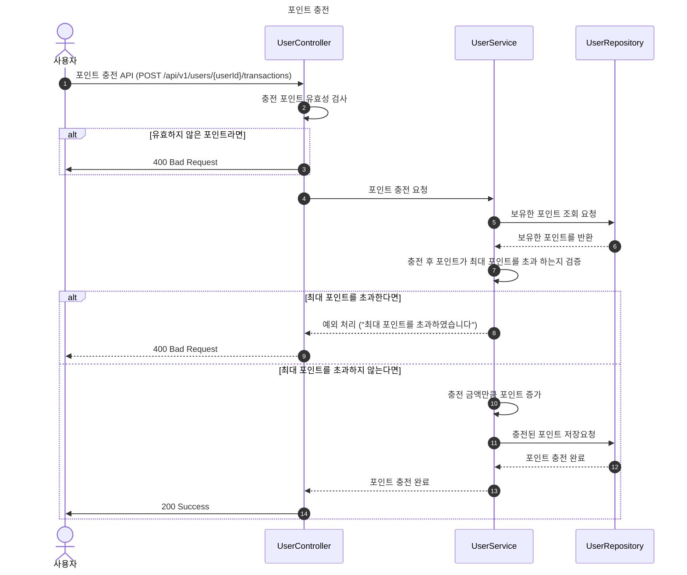

<br>

## 유저 포인트 조회 API

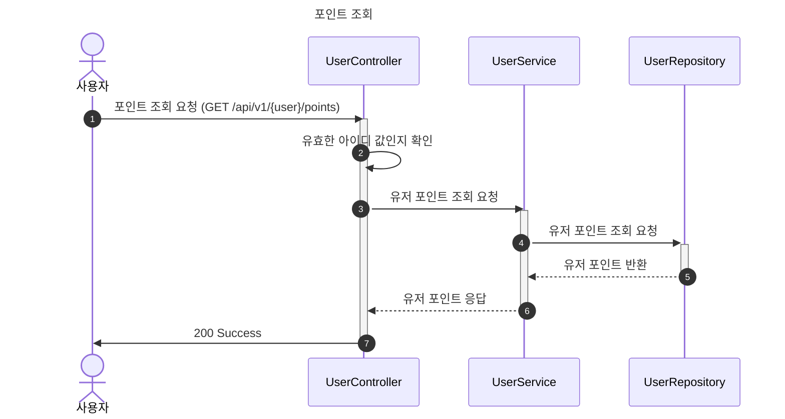

<br>

## 결제 API

- 사용자는 결제를 진행할 수 있어야 한다.
- 결제 후 결제 기록을 남겨야 한다.
- 좌석의 상태는 비활성화로 변경되어진다
- 유저의 대기열 토큰을 만료시킨다

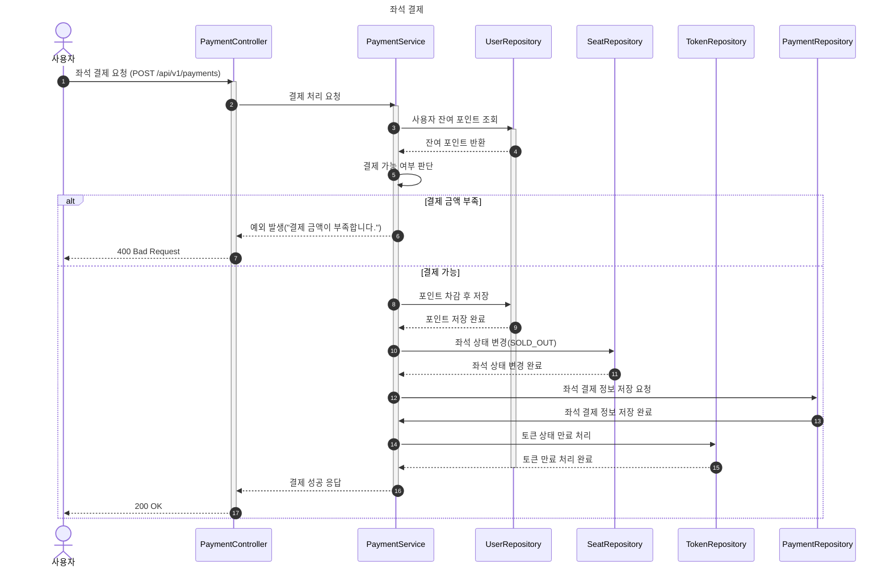


